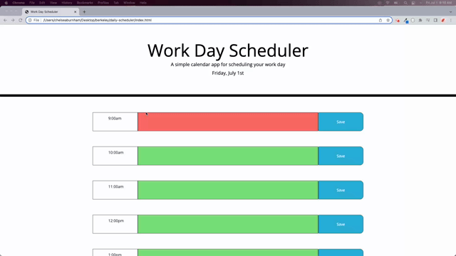

# daily-scheduler

##  Description
This is a daily planning application that utilizes local storage to save your information and persist upon refresh. It recognizes the time of day, so the user can see if events are in the past, present, or future, and easily keep track of daily tasks. 

[Deployable Link](https://chelseaburnham.github.io/daily-scheduler/)

##  Installation
To install this project, fork the repository to your Github account.  
Once on your Github account, clone the repository to your local machine. 

##  Usage
You can use this to design a daily schedule. It saves informaiton to your local storage so you are able to input tasks/to dos each day that will save and appear upon reloading the site.  

##  Credits
[w3schools](https://www.w3schools.com/) 
[Stack Overflow](https://stackoverflow.com/?newreg=8cd9776f072c449eac02d1ab363597c8) 

##  License
[MIT License](https://github.com/chelseaburnham/daily-scheduler/blob/9cc225c856780214701c71f21ca2df0482e73bc7/LICENSE)